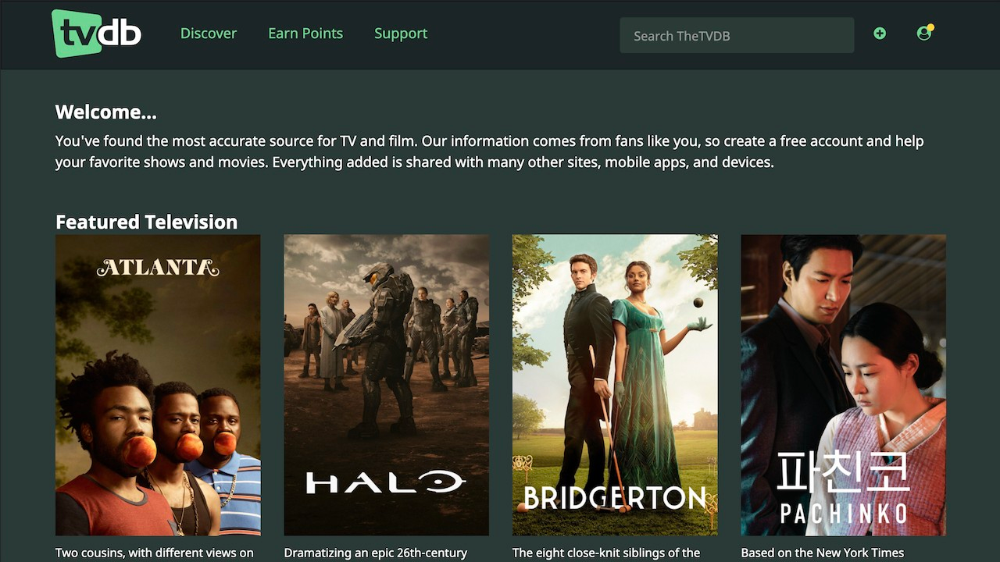
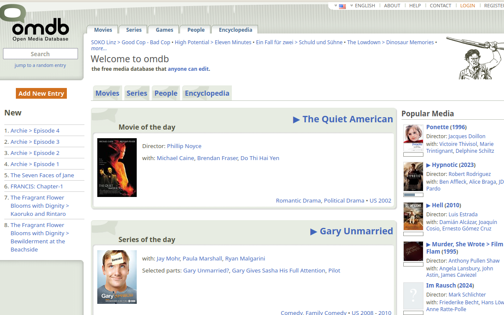

# Movie Database

https://supervisord.org/

### TheTVDB

Nə verir: TV-show / episode metadata, artwork; populyar metadata mənbəyi.

API key? — Bəli (API istifadə üçün qeydiyyat/pullu ketmələr ola bilər).

GDPR / privacy: TheTVDB-nin Privacy Policy və CCPA/other notices mövcuddur — user məlumatları və API istifadəsi ilə bağlı öhdəlikləri göstərir.
TheTVDB

Illik 50k-dan az.

### OMDb (Open Movie Database)

Nə verir: film/serial metadata, poster URL-lər; sadə REST API.

GDPR / privacy: OMDb özü community-drivendir; API apikey ilə istifadə olunur — əgər sən istifadəçi-identifiable data toplayırsansa GDPR nəzərə alınmalıdır (ümumi prinsip).
OMDb API
+1

1000 request etmək olar günlük olaraq
Pulsuz hesab açıb data yığmaq olar GDPR qaydalarına uygundur .
